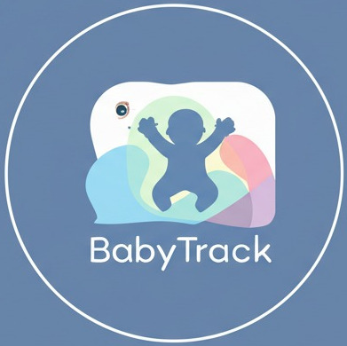

<p align="center">
  
</p>

# BabyTracker

> BabyTracker – Making parenting a little easier, one log at a time.

**BabyTracker** is a comprehensive application designed to help parents and caregivers monitor and track various aspects of infant care and development. The app provides a centralized platform for recording and visualizing important information about your baby's daily activities, health metrics, and milestones.

---

## Features

- **Dashboard**: Get a quick overview of your baby's recent activities and important metrics
- **Calendar**: View and plan activities on a calendar interface
- **Logging System**: Track various aspects of baby care:
  - 💩 **Diaper changes**
  - 🍼 **Feeding sessions**
  - 📏 **Growth measurements**
  - 💊 **Medication administration**
  - 😊 **Mood tracking**
  - 📸 **Photo documentation**
  - 💤 **Sleep patterns**
  - 💉 **Vaccination records**
- **Journal**: Keep notes and memories about your baby's development
- **Settings**: Customize the app according to your preferences

---

## Technology Stack

BabyTracker is built using modern web technologies:

- **Next.js**: React framework for server-rendered applications
- **TypeScript**: For type-safe code
- **CSS**: Styling with global styles

---

## Installation

```bash
# Clone the repository
git clone https://github.com/BharathKumarAI/BabyTrack.git

# Navigate to the project directory
cd BabyTrack

# Install dependencies
npm install
```

## Running the Application

### Development Mode

```bash
npm run dev
```

This will start the development server, typically at [http://localhost:3000](http://localhost:3000)

### Production Build

```bash
# Build the application
npm run build

# Start the production server
npm start
```

---

## Device Compatibility

### Desktop

The application is fully responsive and works on all modern desktop browsers:

- Chrome (recommended)
- Firefox
- Safari
- Edge

### Mobile Devices

BabyTracker is designed with a mobile-first approach:

1. **Browser Access**:

   - Access the deployed URL from any mobile browser
   - For the best experience, add the app to your home screen

2. **Progressive Web App (PWA)**:

   - The app can be installed as a PWA on supported devices
   - On iOS: Use Safari and select "Add to Home Screen"
   - On Android: Use Chrome and select "Add to Home Screen" or "Install App"

3. **Native App Wrapper**:
   - For enhanced native features, the web app can be wrapped using Capacitor or Cordova
   - Instructions for building native apps are in the `/docs` directory

### Tablets

The application is optimized for tablet use with a layout that takes advantage of the larger screen real estate.

---

## Configuration

The app can be configured through environment variables:

1. Create a `.env.local` file in the root directory
2. Add the following variables (customize as needed):

```env
NEXT_PUBLIC_API_URL=your_api_url
NEXT_PUBLIC_STORAGE_URL=your_storage_url
```

---

## Data Privacy

BabyTracker prioritizes the privacy and security of your family's data:

- All data is stored locally by default
- Optional cloud sync with end-to-end encryption
- No data is shared with third parties

---

## Contributing

Contributions are welcome! Please feel free to submit a Pull Request.

1. Fork the repository
2. Create your feature branch (`git checkout -b feature/amazing-feature`)
3. Commit your changes (`git commit -m 'Add some amazing feature'`)
4. Push to the branch (`git push origin feature/amazing-feature`)
5. Open a Pull Request

---

## License

This project is licensed under the MIT License - see the LICENSE file for details.

---
