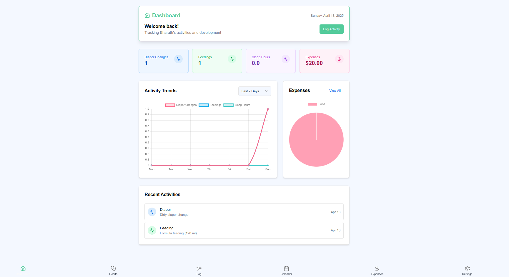
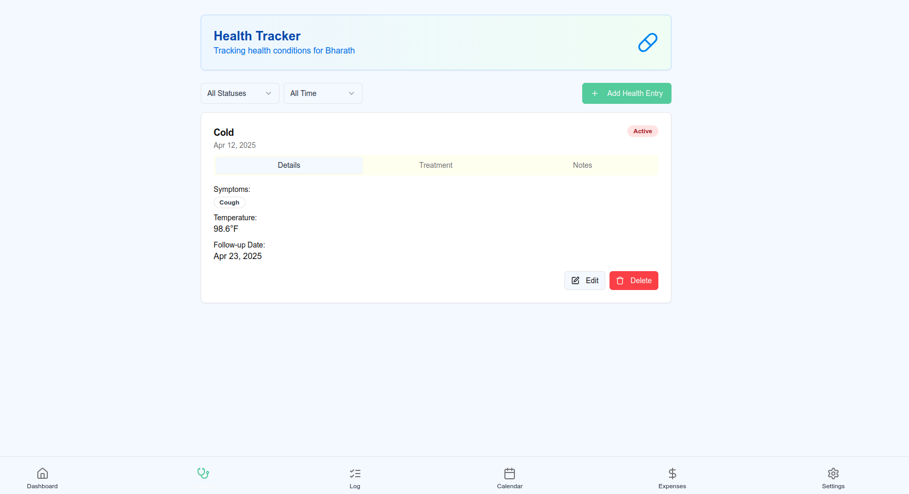
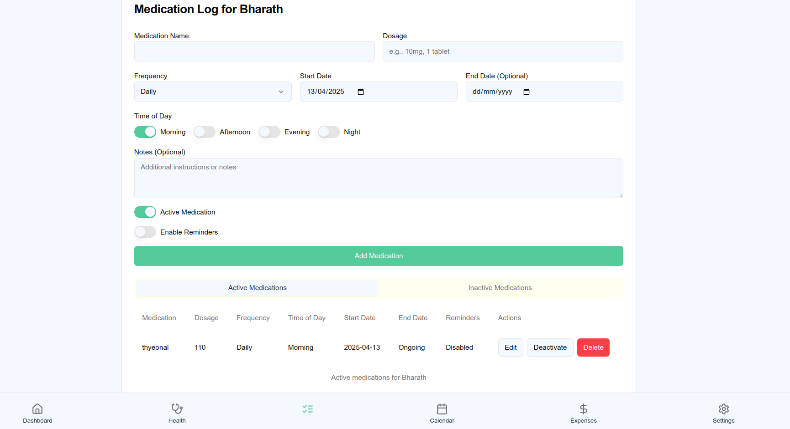
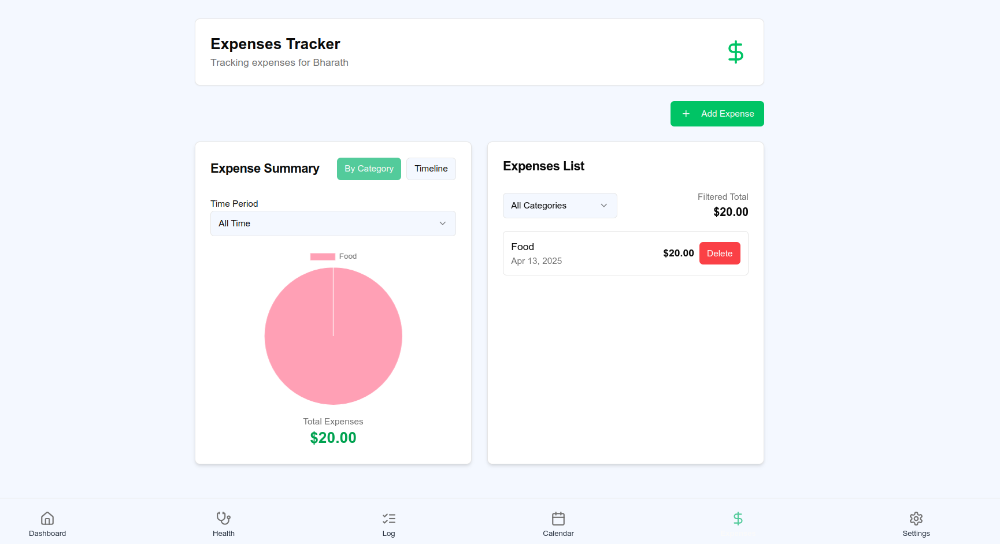

<p align="center">
  
</p>

# BabyTracker 👶

> BabyTracker – Making parenting a little easier, one log at a time.

**BabyTracker** is a comprehensive application designed to help parents and caregivers monitor and track various aspects of infant care and development. The app provides a centralized platform for recording and visualizing important information about your baby's daily activities, health metrics, and milestones.

> 🧠 **Project Note**
>
> This application was primarily developed using **`Vibe Coding`**, with a mix of AI-assisted tools and manual debugging.
>
> ### 🔧 Tools & Technologies:
>
> - [Firebase Studio](https://studio.firebase.google.com/)
> - [Claude Sonnet 3.7 (via ChatLLM)](https://apps.abacus.ai/chatllm)
> - [ChatGPT](https://chatgpt.com/)
>
> 🛠️ Manual refinements were made to resolve errors and improve stability throughout the development process.
>
> ⏱️ **Estimated Development Time**: 8–10 hours

---

## 🚀 Features

- **Dashboard**: Get a quick overview of your baby's recent activities and important metrics
- **Calendar**: View and plan activities on a calendar interface
- **Logging System**: Track various aspects of baby care:
  - 💩 **Diaper changes**
  - 🍼 **Feeding sessions**
  - 📏 **Growth measurements**
  - 💊 **Medication administration**
  - 😊 **Mood tracking**
  - 📸 **Photo documentation**
  - 💤 **Sleep patterns**
  - 💉 **Vaccination records**
- **Journal**: Keep notes and memories about your baby's development
- **Settings**: Customize the app according to your preferences

---

## 🛠️ Technology Stack

BabyTracker is built using modern web technologies:

- **🧭 Next.js**: React framework for server-rendered applications
- **🔷 TypeScript**: For type-safe code
- **🎨 CSS**: Styling with global styles

---

## 🎬 Demo

<video width="600" controls>
  <source src="assets/demo/BabyTrackApp Demo.mp4" type="video/mp4">
  Your browser does not support the video tag.
</video>

> 📱 **Note:** The demo was recorded on a **tablet running Android 14**.

---

---

## 🖥️ Different Screens:

### Dashboard

<p align="center">
  
</p>

### Health Tracking

<p align="center">
  
</p>

### Logs

<p align="center">
  
</p>

#### Medications Logs

<p align="center">
  
</p>

### Expenses

<p align="center">
  
</p>

### Settings

<p align="center">
  
</p>

## Installation

```bash
# Clone the repository
git clone https://github.com/BharathKumarAI/BabyTrack.git

# Navigate to the project directory
cd BabyTrack

# Install dependencies
npm install
```

## Running the Application

### Development Mode

```bash
npm run dev
```

This will start the development server, typically at [http://localhost:9002](http://localhost:9002)

### Production Build

```bash
# Build the application
npm run build

# Start the production server
npm start
```

---

## 📱💻 Device Compatibility

### Desktop

The application is fully responsive and works on all modern desktop browsers:

- Chrome (recommended)
- Firefox
- Safari
- Edge

### Mobile Devices

BabyTracker is designed with a mobile-first approach:

1. **Browser Access**:

   - Access the deployed URL from any mobile browser
   - For the best experience, add the app to your home screen

2. **Progressive Web App (PWA)**:

   - The app can be installed as a PWA on supported devices
   - On iOS: Use Safari and select "Add to Home Screen"
   - On Android: Use Chrome and select "Add to Home Screen" or "Install App"

3. **Native App Wrapper**:
   - For enhanced native features, the web app can be wrapped using Capacitor or Cordova
   - Instructions for building native apps are in the `/docs` directory

### Tablets

The application is optimized for tablet use with a layout that takes advantage of the larger screen real estate.

---

## Deploying App to Android/iOS Devices

### Option 1: Using React Native/Expo

Since app is built with React/Next.js, the most straightforward approach would be to convert it to React Native using Expo:

1. Install Expo CLI:

```bash
npm install -g expo-cli
```

2. Create a new Expo project:

```bash
expo init MobileApp
```

3. Port your React components to React Native:

   - Modify your UI components to use React Native components
   - Update your styling to use React Native's StyleSheet
   - Adapt navigation to React Native navigation libraries

4. Build and deploy:

```bash
expo build:android
expo build:ios
```

### Option 2: Using Capacitor (Recommended)

Capacitor is ideal for web apps like yours and requires minimal changes:

1. Add Capacitor to your project:

```bash
npm install @capacitor/core @capacitor/cli
npx cap init YourAppName com.yourcompany.yourapp
npm install @capacitor/android @capacitor/ios
```

2. Build your Next.js app:

```bash
npm run build
```

> ⚠️ **Note:** For iOS development, Xcode is required — which is only available on **macOS**.

3. Add platforms:

```bash
npx cap add android
npx cap add ios
```

4. Sync your web code to native projects:

```bash
npx cap sync
```

5. Open native IDEs to build:

```bash
npx cap open android
npx cap open ios
```

### Option 3: Using PWA (Progressive Web App)

Convert your Next.js app to a PWA:

1. Add PWA capabilities:

```bash
npm install next-pwa
```

2. Configure `next.config.js`:

```javascript
const withPWA = require("next-pwa")({
  dest: "public",
  register: true,
  skipWaiting: true,
});

module.exports = withPWA({
  // your other Next.js configs
});
```

---

## 🚀 Potential Enhancements

> These are some ideas for future improvements. Please note that I may not actively work on implementing them:

- 🔐 Replace the current profile selection via the settings icon with a login-based system. The app would automatically use the logged-in user's profile.
- 🤖 Integrate Generative AI (GenAI) insights based on user data input. AI-related modules can be placed in the `src/ai` directory and imported where needed.
- ☁️ Implement full backend integration and enable cloud synchronization for persistent and seamless data access.

---

## 🔒 Data Privacy

BabyTracker prioritizes the privacy and security of your family's data:

- All data is stored locally by default
- No data is shared with third parties

---

## 🤝 Contributing

Contributions are welcome! Please feel free to submit a Pull Request.

1. Fork the repository
2. Create your feature branch (`git checkout -b feature/amazing-feature`)
3. Commit your changes (`git commit -m 'Add some amazing feature'`)
4. Push to the branch (`git push origin feature/amazing-feature`)
5. Open a Pull Request

---

## 📱 Connect with me on LinkedIn

Feel free to connect with me on [LinkedIn](https://www.linkedin.com/in/bharath-kumar-98393282/).

## Let's collaborate and grow together! 🚀
